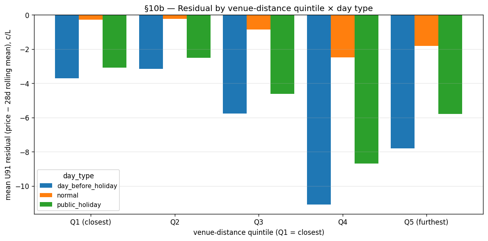
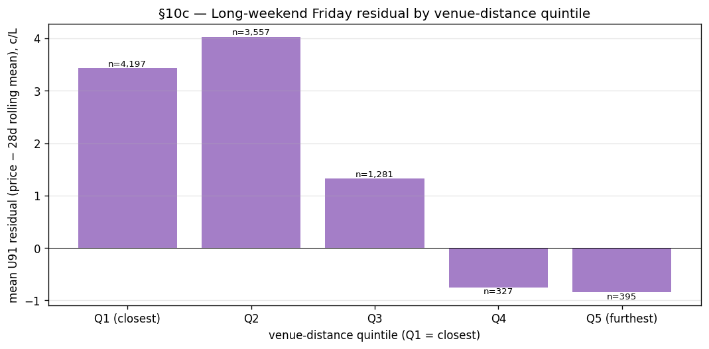

# Major events EDA gate — outcome

**Date:** 2026-05-26
**Source doc:** [`2026-05_major_events_features.md`](2026-05_major_events_features.md)
**Notebook:** `notebooks/01_eda.ipynb` §10

## Decision rule (from the source doc)

- Q1 vs Q5 residual gap on holiday/pre-holiday rows **≥ 1 c/L** → proceed to Phase 1
- Gap **< 0.5 c/L** across all day types → stop, record null result
- Between 0.5 and 1.0 c/L → ambiguous; long-weekend Friday signal is the tiebreaker

## What §10a showed (venue distance distribution)

4,587 NSW stations were joined to the 10 pilot venues (all in greater Sydney + Newcastle) by nearest-venue haversine distance. The quintile bins are skewed to short distances at Q1 and long distances at Q5, as expected when all venues cluster in two metro regions:

| Quintile | Count | Min km | Median km | Max km |
|---|---:|---:|---:|---:|
| Q1 (closest) | 919 | 0.16 | 5.38 | 8.90 |
| Q2 | 916 | 8.91 | 15.18 | 32.15 |
| Q3 | 917 | 32.17 | 60.31 | 148.93 |
| Q4 | 917 | 150.07 | 235.00 | 334.53 |
| Q5 (furthest) | 918 | 334.57 | 430.61 | 952.27 |

In practice: Q1 = inner-metro Sydney/Newcastle, Q2 = greater-metro fringe, Q3 = Central Coast / Wollongong / Hunter, Q4 = mid-regional NSW (Dubbo, Tamworth, Wagga belt), Q5 = far-regional (Broken Hill, far north/south coast).

## What §10b showed (residual by distance quintile × day type)

1,248,018 joined U91 rows. Mean residual (price − 28-day rolling mean, c/L):

| day_type | Q1 (closest) | Q2 | Q3 | Q4 | Q5 (furthest) |
|---|---:|---:|---:|---:|---:|
| normal | -0.274 | -0.222 | -0.842 | -2.477 | -1.808 |
| public_holiday | -3.082 | -2.502 | -4.604 | -8.692 | -5.789 |
| day_before_holiday | -3.693 | -3.162 | -5.754 | -11.075 | -7.805 |

Q1 vs Q5 gap (c/L, positive = metro residual *higher* than far-regional):
- normal: **+1.534**
- public_holiday: **+2.707**
- day_before_holiday: **+4.112**

All three gaps clear the 1.0 c/L threshold. The pre-holiday signal (+4.1 c/L) is the strongest.

**Important nuance:** the relationship is not monotonic. Q4 (mid-regional) consistently shows the *most negative* residuals — prices furthest below the 28-day rolling mean — and Q5 (far-regional) rebounds partway. This looks less like a clean "events drive metro prices up" story and more like "metro stations follow a tighter petrol-cycle band while mid-regional stations show the biggest cycle troughs on quiet days". Some of the apparent signal could be metro vs regional cycle-amplitude differences correlated with (but not caused by) venue proximity. Phase 1 should test whether `stn_is_metro` already captures the bulk of this gap — if so, the venue-distance feature may be redundant rather than additive.

## What §10c showed (long-weekend Friday)

9,757 rows across 28 unique long-weekend Fridays:

| Quintile | Mean residual (c/L) | n |
|---|---:|---:|
| Q1 (closest) | +3.428 | 4,197 |
| Q2 | +4.027 | 3,557 |
| Q3 | +1.324 | 1,281 |
| Q4 | -0.750 | 327 |
| Q5 (furthest) | -0.847 | 395 |

Q1 − Q5 gap: **+4.275 c/L**

This is the strongest signal of any §10 cell and the most directionally clean: residuals are elevated near venues (Q1/Q2 both +3 to +4 c/L) and slightly negative far away (Q4/Q5). Long-weekend Fridays appear to be a real metro-precinct demand event, distinct from the cycle-amplitude story above. Note the small Q4/Q5 sample sizes (n=327, 395 — only ~12 obs per long-weekend Friday per quintile) which limits the precision of those two cells; the Q1/Q2 numbers (n=4,197, 3,557) are well-supported.

## Verdict

**PROCEED** — the Q1 vs Q5 gap on holiday/pre-holiday rows is **+2.71 c/L (public_holiday) and +4.11 c/L (day_before_holiday)**, both well above the 1.0 c/L threshold. The long-weekend Friday signal (+4.28 c/L) is even cleaner directionally. Spec §13.6 should be expanded to a multi-phase implementation plan (Phases 1-4 in the research doc).

Two caveats the human reviewer should weigh before committing to all four phases:

1. **Metro vs regional confound.** Q4 (mid-regional) is the most-negative quintile across all day types, breaking the monotonic Q1→Q5 trend the hypothesis predicts. Phase 1 should sanity-check whether `stn_is_metro` (already in the feature matrix) absorbs most of the signal before claiming the venue-distance features are additive.
2. **Long-weekend Friday is the cleanest signal.** If Phase 1 confirms the metro/regional confound on the holiday-day signal, the highest-value subset of the work is the long-weekend Friday derived feature (`cal_is_pre_long_weekend`, no API dependency) plus the static `stn_nearest_venue_*` block — these can ship in one Phase 1 PR. The AFL/NRL fixture-calendar work (Phases 2-3) only pays back if §10c's cleanness generalises to in-season game days specifically.

## What to do next

1. **Phase 1 first, scoped tightly.** Build `stn_nearest_venue_km`, `stn_nearest_venue_capacity`, `stn_n_venues_within_5km` (static, from `major_venues.csv`) + `cal_is_pre_long_weekend` (derived). Train Model C = Model B + this block. If MAE drop on the long-weekend Friday subset ≥ 0.5 c/L vs Model B, the static + derived features are pulling their weight.
2. **Add an interaction probe to Phase 1.** Before Phase 2, train a side-experiment with the venue-distance block plus an explicit `stn_is_metro × cal_is_public_holiday` interaction term. If the venue-distance feature is mostly a metro/regional proxy, this side-experiment will reveal it cheaply.
3. **Gate Phase 2 (AFL Squiggle) on Phase 1 holdout performance.** If Phase 1's long-weekend Friday MAE drop is < 0.3 c/L, the marginal value of building the fixture calendar drops sharply — re-scope to long-weekend-only feature and close out §13.6.
4. **Defer the venue lifecycle concern (R6 in the source doc).** The bake-in approximation is fine for the Phase 1 sanity check; revisit only if SHAP shows the `stn_nearest_venue_*` block ranking high.
